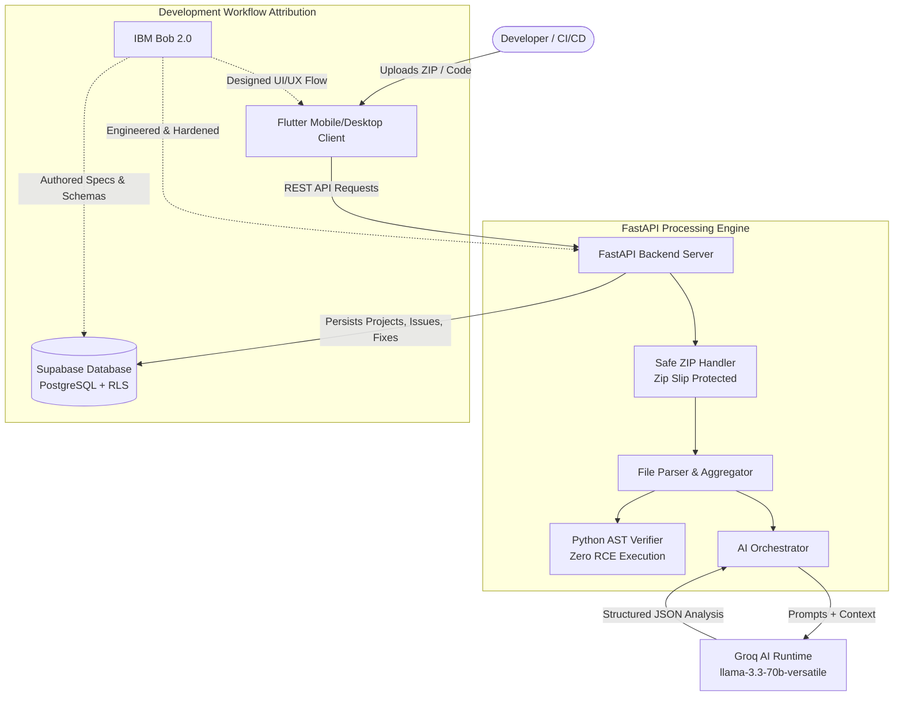

# DevFlow System Architecture

## 1. High-Level Overview

DevFlow is an end-to-end automated software auditing, AI code remediation, and AST verification gatekeeper built to accelerate developer velocity while guaranteeing code security.

---

## 2. Component Stack

| Layer | Technology | Primary Role |
| :--- | :--- | :--- |
| **Frontend** | **Flutter (Dart)** | Modern developer dashboard, charts (fl_chart), project uploads, real-time remediation view |
| **API Server** | **FastAPI (Python)** | Asynchronous REST API, CORS middleware, multipart upload handling |
| **AI Runtime** | **Groq API** (`llama-3.3-70b`) | Real-time security auditing, bug detection, automated fix generation, and test synthesis |
| **Verification Gate** | **Python AST (`ast.parse`)** | Safe syntax verification ensuring zero remote code execution risk on uploaded code |
| **Persistence** | **Supabase (PostgreSQL)** | Cloud storage for projects, analyses, issues, fixes, and verification audit trails with RLS |
| **AI Engineering Copilot** | **IBM Bob 2.0** | Used throughout the development lifecycle for architecture, implementation, debugging, and testing |

---

## 3. Data Flow

### A. Project Upload & Indexing Flow
1. Developer selects a `.zip` archive or directory in the Flutter UI.
2. Flutter sends `POST /projects/upload` to the FastAPI backend.
3. `zip_handler.py` inspects each archive member:
   - Blocks any path containing `..` or absolute paths.
   - Extracts safely into an isolated workspace directory.
4. `file_parser.py` scans all valid source files, filters out binaries and vendor artifacts, and produces unified context.
5. Project record is saved in-memory and synced to Supabase.

### B. AI Analysis Workflow
1. Client triggers `POST /projects/{id}/analyze`.
2. `analysis_service.py` formats the project text into `ANALYSIS_USER` prompt with system rules `ANALYSIS_SYSTEM`.
3. `groq_client.py` initiates a low-temperature request to Groq (`llama-3.3-70b-versatile`) requiring strict JSON output.
4. Raw response is parsed, validated against the Pydantic `Analysis` schema, cached, and persisted.
5. Flutter receives issues categorized into **Security**, **Bug**, **Testing**, and **Maintainability** with severity levels.

### C. Remediation & Fix Plan Workflow
1. User clicks "Fix" on a detected issue in Flutter.
2. Client invokes `POST /issues/fix`.
3. Groq generates:
   - Root cause analysis
   - Files to change
   - Step-by-step implementation instructions
   - Unified code diff
   - Regression test requirements

### D. Safe AST Verification Gate
1. Client invokes `POST /projects/{id}/verify`.
2. `verification_service.py` runs Python's native AST parser across all Python source modules.
3. Syntax errors, line numbers, and parsing integrity are validated.
4. If syntax passes, project status updates to `VERIFIED`.

### E. Release Readiness Report
1. Client calls `POST /projects/{id}/report`.
2. AI combines active AST verification status with resolved vs open issues to produce an executive release recommendation.
